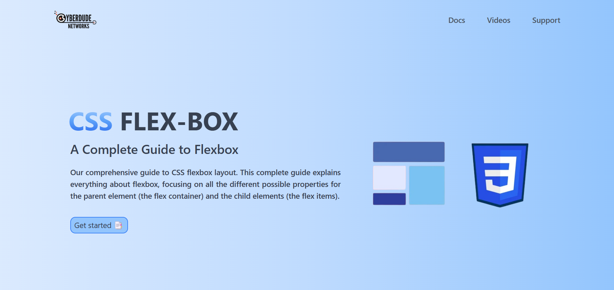

# css- flexbox Landing Page 👋

## Table of Contents

- [Project Title](#project-title)

- [Description](#description)

- [Demo](#demo)

- [Internship](#internship)

- [Technologies Used](#technologies-used)

- [Installation](#installation)


- [License](#license)

- [Acknowledgments](#acknowledgments)

## Description

I create a simple css-flexbox landing page by using HTML and TailwindCSS , you can learn more about clear image and content of css flexbox in simple way.

## Demo

[Live preview](https://kishorekpcssflexbox.netlify.app/)

<a href="">



</a>

<!-- [Include links to a live demo, screenshots, or GIFs that showcase your project in action.] -->

## Internship

This internship is provided by [CyberDude Networks Pvt. Ltd.](https://youtube.com/cyberdudenetworks) as part of the 6-Month Free Internship program, a skill development initiative organized to enhance participants' skills. Mentoring was provided by [Mr. Anbuselvan Rocky](https://instagram.com/anbuselvanrocky). For more information, [you can contact CyberDude Networks here](https://cyberdudenetworks.com).

## Technologies Used

<ol>
<li>HTML</li>
<li>TailwindCSS</li>
</ol>

## Installation

<h3>Clone the Repository:</h3>


Install the Dependencies

```
npm install
```

Run the Project

```
npm run dev
```

## License

[MIT](./LICENCE.md)

## Acknowledgments

Design inspired from [Nuxt - vue framework](https://nuxt.com/)

Get those images from [css-tricks](https://css-tricks.com/snippets/css/a-guide-to-flexbox/)

---

Reach me to LinkedIn **https://www.linkedin.com/in/kishorekumar-kp/** 

